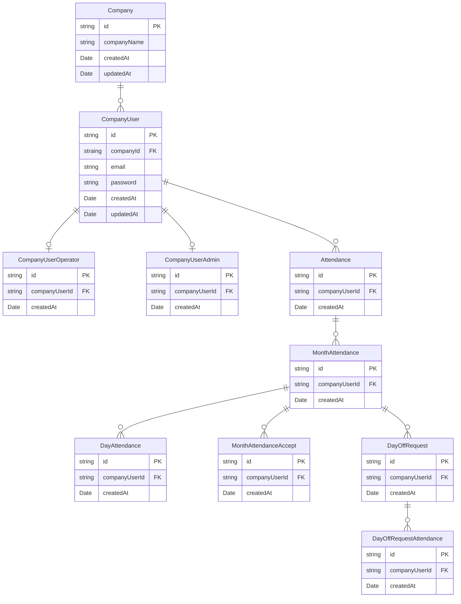

# はじめに

今回は私が業務で身につけたバックエンドの詳細設計の方法についてご紹介しようと思います。書籍等で体系的に会得した訳ではないので自己流な部分もあると思いますが、なにかしら知見にはなると思うので是非ご覧ください
# 詳細設計の前提

大前提としてチームや会社によって詳細設計が指すものは様々です。ですのでここで一旦前提を揃えておこうと思います。

- 要件定義、基本設計済み
- Figma等でワイヤーが用意されている
- この状態でBEに必要な要素を設計する

# 全体の流れ
全体としては以下の流れで進めていきます。ここではあくまで詳細設計について紹介していくので個々の設計の詳細には触れません。

- ユースケースを書き出す
- API設計
- テーブル設計
- クラス設計

# ユースケースを書き出す
個人的には詳細設計において一番の要だと思っています。
## ユースケースを分解する

# API設計
# ER図

# クラス設計

# 意識するポイント
## 齟齬がないような正確な言葉を使う
## どんな人が読んでも同じ設計通りになるように書く
## 一見普通ではないものには意図を添える
# Throttle v2での詳細設計

# 詳細設計をさらに学びたい方へ
