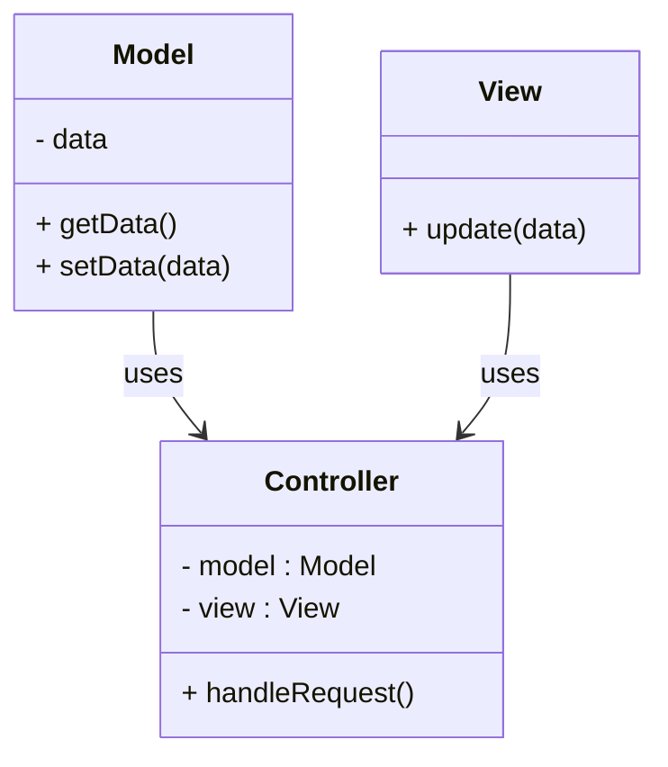
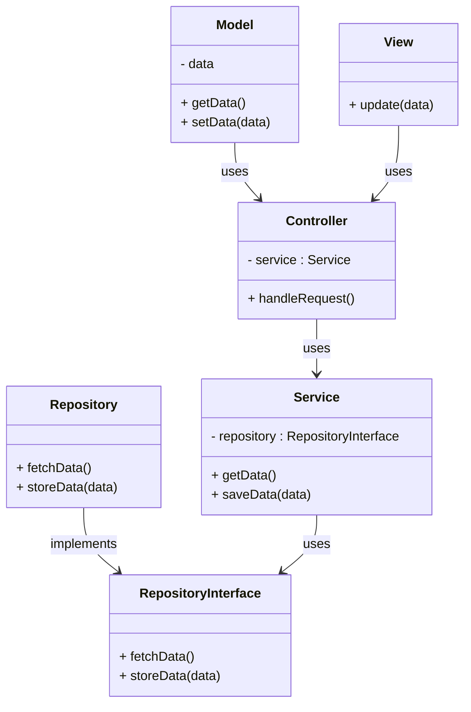
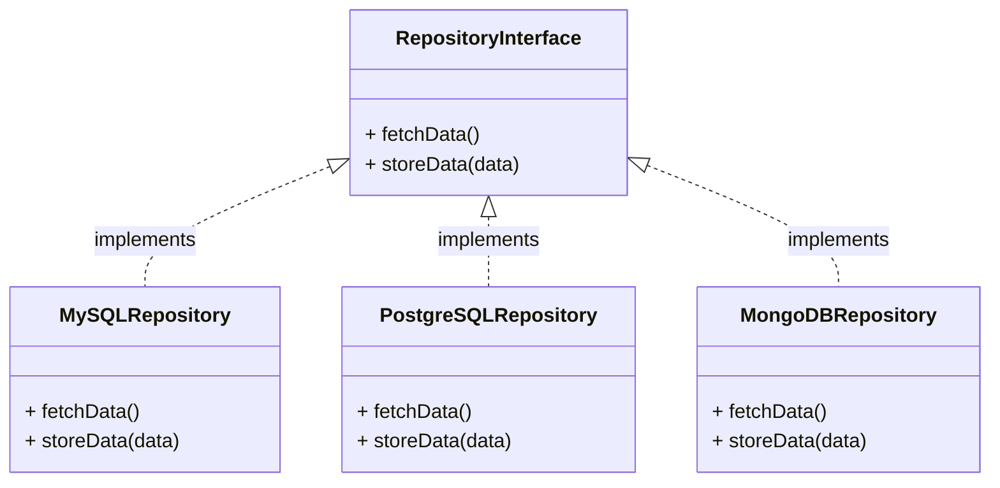

# 初心者向け　 Repostitory パターンを解説してみた

## はじめに

以下の人向けの記事です

- web アプリケーションのバックエンドをちょっと勉強した人

- MVC をちょっと理解した人

- Repository パターンについてざっくり知りたい、イメージを持ちたい人

## Repostirory パターンとは

Repostitory パターンはデザインパターンというものの一種です。デザインパターンとは簡単に言えばよく使える設計の構成パターンをまとめたものです。Repository パターンは MVC の C(Controller)にあたる部分をより細分化して使いやすくするものです。

### 従来の MVC の構成



## Repostirory パターンの構成

以下に構成を示します。

Repository パターンは従来の MVC でコントローラが担っていたサービスロジックやデータアクセスを細分化していきます。



## 従来の MVC のときの Controller との違い

### 従来の Controller

従来の MVC では Controller は以下のような役割を担っていました。

- リクエストの入力処理

- ビジネスロジック

- データベースからのデータの取得

ビジネスロジックと聞くとあまり聞き慣れないかもしれませんが、データを取得してからレスポンスするまでのデータ処理のことだと思っておいてください。詳しく知りたい方は[こちら](https://qiita.com/os1ma/items/25725edfe3c2af93d735)を参考にしてみてください。

### この構成のデメリット

このように一つのクラスが複数の役割を持つのは[単一責任の原則](https://qiita.com/conkon326/items/1ce5a4e5b8430c4e26d5)に反していて、コードの拡張や保守がしにくくなってしまいます。要は一つのクラスに多くの処理がまとまっているとデバッグ等がしにくくなるということです。今のコントローラには三つも機能があるのでデバッグもしにくくなるわけです。

#### UserController.php

```:php

<?php


namespace App\Http\Controllers;


use App\Services\UserService;

use Illuminate\Http\Request;

use Illuminate\Http\Response;


class UserController extends Controller

{

private $userService;


public function __construct(UserService $userService)

{

$this->userService = $userService;

}


public function getUserById($id)

{

$user = $this->userService->getUserById($id);


if (!$user) {

return response()->json(['error' => 'User not found'], Response::HTTP_NOT_FOUND);

}


return response()->json($user);

}


public function getAllUsers()

{

$users = $this->userService->getAllUsers();

return response()->json($users);

}


public function createUser(Request $request)

{

$user = $this->userService->createUser($request->all());

return response()->json($user, Response::HTTP_CREATED);

}


public function deleteUser($id)

{

$this->userService->deleteUser($id);

return response()->json(null, Response::HTTP_NO_CONTENT);

}

}


```

#### Repostiry パターンでの改善策

Repository パターンではこれを以下のように分けてあげます

- リクエストの入力処理:Controller

- ビジネスロジック:Service

- データベースからのデータの取得:Repository

このように分けてあげることでそれぞれのクラスが責任を一つずつ負うことになり、拡張性、保守性が向上します。

#### UserController.php

```php:UserController.php


<?php


namespace App\Http\Controllers;


use App\Services\UserService;

use Illuminate\Http\Request;

use Illuminate\Http\Response;


class UserController extends Controller

{

private $userService;


public function __construct(UserService $userService)

{

$this->userService = $userService;

}


public function getUserById($id)

{

$user = $this->userService->getUserById($id);


if (!$user) {

return response()->json(['error' => 'User not found'], Response::HTTP_NOT_FOUND);

}


return response()->json($user);

}


public function getAllUsers()

{

$users = $this->userService->getAllUsers();

return response()->json($users);

}


public function createUser(Request $request)

{

$user = $this->userService->createUser($request->all());

return response()->json($user, Response::HTTP_CREATED);

}


public function deleteUser($id)

{

$this->userService->deleteUser($id);

return response()->json(null, Response::HTTP_NO_CONTENT);

}

}


```

#### UserService.php

```php:UserService.php

<?php


namespace App\Services;


use App\Repositories\UserRepository;

use Illuminate\Support\Facades\Hash;


class UserService

{

private $userRepository;


public function __construct(UserRepository $userRepository)

{

$this->userRepository = $userRepository;

}


public function getUserById($id)

{

return $this->userRepository->findById($id);

}


public function getAllUsers()

{

return $this->userRepository->findAll();

}


public function createUser($data)

{

$validatedData = $this->validateUserData($data);

$validatedData['password'] = Hash::make($validatedData['password']);

return $this->userRepository->save($validatedData);

}


public function deleteUser($id)

{

$this->userRepository->deleteById($id);

}


private function validateUserData($data)

{

return validator($data, [

'name' => 'required|string|max:255',

'email' => 'required|string|email|max:255|unique:users',

'password' => 'required|string|min:8',

])->validate();

}

}


```

#### UserRepository.php

```php:UserRepository.php

<?php


namespace App\Repositories;


interface UserRepository

{

public function findById($id);

public function findAll();

public function save(array $user);

public function deleteById($id);

}


```

#### UserRepositoryImpl.php

```php:UserRepositoryImpl.php

<?php


namespace App\Repositories;


use App\Models\User;


class UserRepositoryImpl implements UserRepository

{

public function findById($id)

{

return User::find($id);

}


public function findAll()

{

return User::all();

}


public function save(array $user)

{

return User::create($user);

}


public function deleteById($id)

{

$user = User::find($id);

if ($user) {

$user->delete();

}

}

}


```

### Repository Interface の役割

クラス図を見ると Repository Interface が定義されています。ただ web アプリケーションをそのまま実装するとこのインターフェースは役割が無い様に見えると思います。しかし、複数のデータベースを実装するときにこのインターフェースはその役割を果たします。

このように複数 DB を使ったり切り替える場合にインターフェースを定義しておくと保守性がさらに向上します



## まとめ

以上、簡単な Repository パターンのまとめでした！本来はもっと奥深いものだったりしますがまずはその触りになれればと思います！
