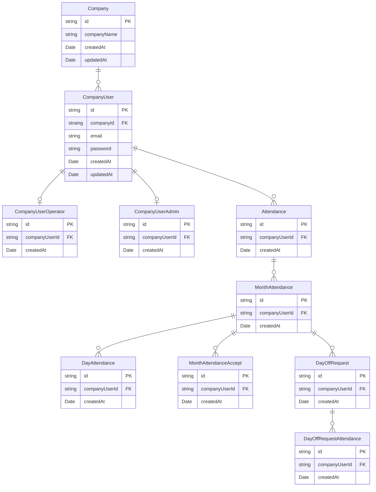

# ER図

```mermaid
erDiagram
    Company{
        string id PK
        string companyName
        Date   createdAt
        Date   updatedAt
    }

    CompanyUser {
        string id PK
        straing companyId FK
        string email
        string password
        Date   createdAt
        Date   updatedAt
    }

    CompanyUserOperator {
        string id PK
        string companyUserId FK
        Date   createdAt
    }

    Company ||--o{ CompanyUser: ""
    CompanyUser ||--o| CompanyUserOperator: ""

    CompanyUserAdmin {
        string id PK
        string companyUserId FK
        Date   createdAt
    }

    CompanyUser ||--o| CompanyUserAdmin: ""

    Attendance {
        string id PK
        string companyUserId FK
        Date   createdAt
    }

    CompanyUser ||--o{ Attendance: ""

    MonthAttendance {
        string id PK
        string companyUserId FK
        Date   createdAt
    }

    Attendance ||--o{ MonthAttendance: ""

    MonthAttendance ||--o{ DayAttendance: ""

    DayAttendance {
        string id PK
        string companyUserId FK
        Date   createdAt
    }

    MonthAttendanceAccept {
        string id PK
        string companyUserId FK
        Date   createdAt
    }

    MonthAttendance ||--o{ MonthAttendanceAccept: ""

    DayOffRequest {
        string id PK
        string companyUserId FK
        Date   createdAt
    }
    MonthAttendance ||--o{ DayOffRequest: ""

    DayOffRequestAttendance {
        string id PK
        string companyUserId FK
        Date   createdAt
    }
    DayOffRequest ||--o{ DayOffRequestAttendance: ""
```
