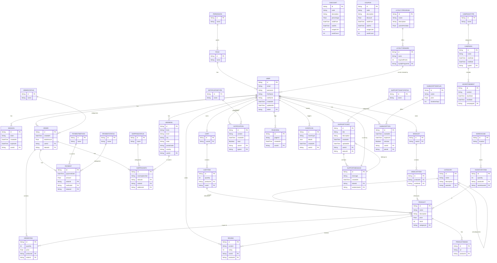

```mermaid
erDiagram
USER {
String id PK
String email
String password
String firstName
String lastName
DateTime createdAt
DateTime updatedAt
String roleId FK
}

    ROLE {
        String id PK
        String name
    }

    PERMISSION {
        String id PK
        String name
    }

    SESSION {
        String id PK
        String token
        DateTime createdAt
        DateTime expiresAt
        String userId FK
    }

    PRODUCT {
        String id PK
        String name
        String description
        Float price
        Int stock
        String categoryId FK
    }

    CATEGORY {
        String id PK
        String name
        String description
        String parentId FK
    }

    PRODUCTIMAGE {
        String id PK
        String url
        String productId FK
    }

    ORDER {
        String id PK
        DateTime createdAt
        Float totalAmount
        String userId FK
        String statusId FK
    }

    ORDERITEM {
        String id PK
        Int quantity
        Float price
        String productId FK
        String orderId FK
    }

    ORDERSTATUS {
        String id PK
        String name
    }

    PAYMENT {
        String id PK
        DateTime paymentDate
        Float amount
        String orderId FK
        String methodId FK
        String statusId FK
    }

    PAYMENTMETHOD {
        String id PK
        String name
    }

    PAYMENTSTATUS {
        String id PK
        String name
    }

    REVIEW {
        String id PK
        String content
        Int rating
        String userId FK
        String productId FK
    }

    SHIPPINGINFO {
        String id PK
        String trackingNumber
        String statusId FK
        String orderId FK
        String addressId FK
    }

    SHIPPINGSTATUS {
        String id PK
        String name
    }

    ADDRESS {
        String id PK
        String line1
        String line2
        String city
        String state
        String postalCode
        String country
        String userId FK
    }

    CART {
        String id PK
        String userId FK
    }

    CARTITEM {
        String id PK
        Int quantity
        String productId FK
        String cartId FK
    }

    WISHLIST {
        String id PK
        String userId FK
    }

    WISHLISTITEM {
        String id PK
        String productId FK
        String wishlistId FK
    }

    NOTIFICATION {
        String id PK
        String content
        DateTime createdAt
        Boolean read
        String userId FK
        String typeId FK
    }

    NOTIFICATIONTYPE {
        String id PK
        String name
    }

    DISCOUNT {
        String id PK
        String code
        String description
        Float percentage
        DateTime validFrom
        DateTime validTo
        Int usageLimit
        Int usedCount
    }

    COUPON {
        String id PK
        String code
        String description
        Float discount
        DateTime validFrom
        DateTime validTo
        Int usageLimit
        Int usedCount
    }

    PAGEVIEW {
        String id PK
        String pageUrl
        DateTime createdAt
        String userId FK
    }

    EVENTLOG {
        String id PK
        String eventType
        Json details
        DateTime createdAt
        String userId FK
    }

    SUPPORTTICKET {
        String id PK
        String title
        String description
        DateTime createdAt
        DateTime updatedAt
        String userId FK
        String statusId FK
    }

    SUPPORTTICKETSTATUS {
        String id PK
        String name
    }

    SUPPORTMESSAGE {
        String id PK
        String message
        DateTime createdAt
        String ticketId FK
        String senderUserId FK
    }

    WAREHOUSE {
        String id PK
        String location
    }

    INVENTORYITEM {
        String id PK
        Int quantity
        String productId FK
        String warehouseId FK
    }

    LOYALTYPROGRAM {
        String id PK
        String name
        String description
        Float pointsPerDollar
    }

    LOYALTYREWARD {
        String id PK
        String name
        Int requiredPoints
        String loyaltyProgramId FK
    }

    SUBSCRIPTION {
        String id PK
        DateTime startedAt
        DateTime expiresAt
        Boolean isActive
        String userId FK
        String planId FK
    }

    SUBSCRIPTIONPLAN {
        String id PK
        String name
        Float price
        Int durationDays
    }

    CAMPAIGN {
        String id PK
        String name
        DateTime startDate
        DateTime endDate
        String typeId FK
    }

    CAMPAIGNTYPE {
        String id PK
        String name
    }

    ADVERTISEMENT {
        String id PK
        String content
        DateTime startDate
        DateTime endDate
        String campaignId FK
    }

    USER ||--o{ ORDER : "has"
    USER ||--o{ SESSION : "has"
    USER ||--o{ REVIEW : "writes"
    USER ||--o| CART : "owns"
    USER ||--o| WISHLIST : "owns"
    USER ||--o{ ADDRESS : "has"
    USER ||--o{ PAGEVIEW : "logs"
    USER ||--o{ EVENTLOG : "triggers"
    USER ||--o{ SUPPORTTICKET : "creates"
    USER ||--o{ NOTIFICATION : "receives"
    USER ||--o{ SUBSCRIPTION : "has"
    ROLE ||--o{ USER : "has"
    PERMISSION ||--o{ ROLE : "grants"
    ORDER ||--o{ ORDERITEM : "contains"
    ORDER ||--|{ SHIPPINGINFO : "has"
    ORDER ||--|{ PAYMENT : "has"
    ORDERSTATUS ||--o{ ORDER : "categorizes"
    PAYMENTMETHOD ||--o{ PAYMENT : "is used in"
    PAYMENTSTATUS ||--o{ PAYMENT : "categorizes"
    PRODUCT ||--o{ ORDERITEM : "is part of"
    PRODUCT ||--o{ REVIEW : "receives"
    PRODUCT ||--o{ PRODUCTIMAGE : "has"
    CATEGORY ||--o{ PRODUCT : "groups"
    CATEGORY ||--o| CATEGORY : "subcategorizes"
    CART ||--o{ CARTITEM : "contains"
    CARTITEM ||--|{ PRODUCT : "references"
    WISHLIST ||--o{ WISHLISTITEM : "contains"
    WISHLISTITEM ||--|{ PRODUCT : "references"
    NOTIFICATIONTYPE ||--o{ NOTIFICATION : "categorizes"
    SHIPPINGSTATUS ||--o{ SHIPPINGINFO : "categorizes"
    ADDRESS ||--o{ SHIPPINGINFO : "is used in"
    SUPPORTTICKET ||--o{ SUPPORTMESSAGE : "contains"
    SUPPORTTICKETSTATUS ||--o{ SUPPORTTICKET : "categorizes"
    SUPPORTMESSAGE ||--|{ USER : "is sent by"
    SUPPORTMESSAGE ||--|{ SUPPORTTICKET : "belongs to"
    WAREHOUSE ||--o{ INVENTORYITEM : "stores"
    INVENTORYITEM ||--|{ PRODUCT : "is"
    LOYALTYPROGRAM ||--o{ LOYALTYREWARD : "offers"
    LOYALTYREWARD ||--o{ USER : "can be claimed by"
    SUBSCRIPTIONPLAN ||--o{ SUBSCRIPTION : "offers"
    CAMPAIGNTYPE ||--o{ CAMPAIGN : "categorizes"
    CAMPAIGN ||--o{ ADVERTISEMENT : "includes"
```
