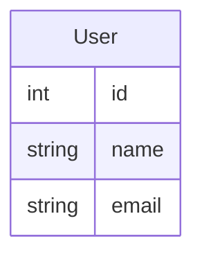
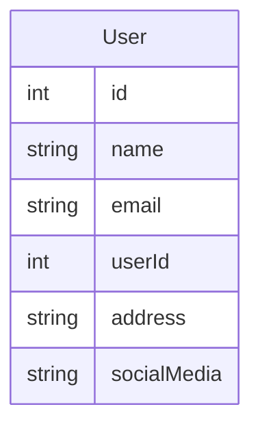
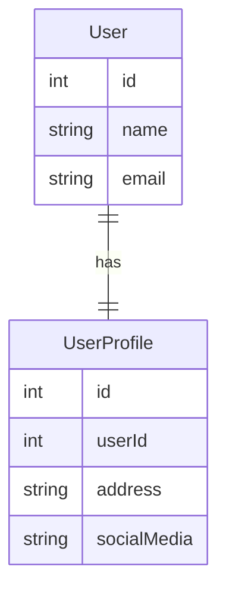
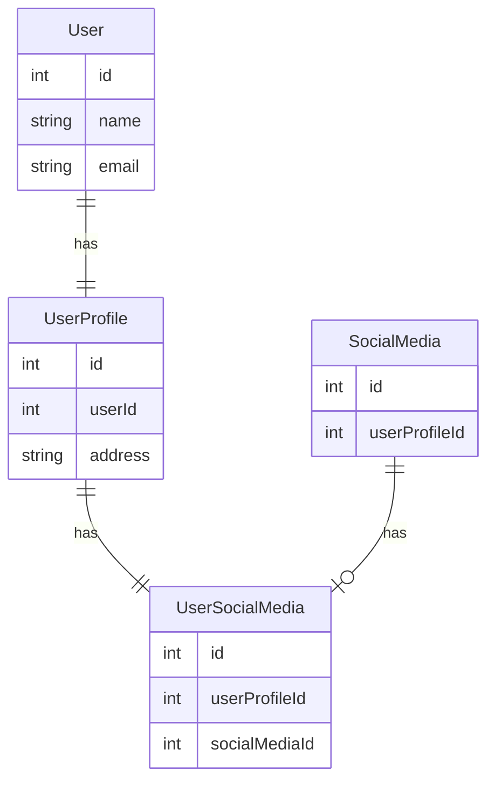

# はじめに

テーブルに情報を増やしたいときにカラムを追加するか子テーブルを作成するか悩むケースがあると思います。この記事では、自分の考えるカラム追加と子テーブル作成について、それぞれのメリットとデメリットを解説します。

# 前提

親テーブルと子テーブルのリレーションが 1:1 でない場合、子テーブルを選ぶのが明確な選択肢となります。そのため、**今回考慮するのは親子テーブルが 1:1 のリレーションである場合**に限定します。

例として、User テーブルにプロフィール情報を追加する場合を考えます。



これにカラムを追加すると以下のようになります



一方子テーブルを増やすと以下のようになります



# クエリの簡単さ

## カラム追加の場合

カラムを増やす場合、JOIN を使う必要がないため、SELECT クエリがシンプルになります

```sql
SELECT * FROM User;
```

## 子テーブルを増やす場合

子テーブルを使用すると、クエリで JOIN を多用する必要があります。そのため、クエリが複雑化し、「どのテーブルを結合するか」に注意しなければならなくなります。また、JOIN の仕方も考える必要が出てきます。

```sql
SELECT * FROM User
INNER JOIN UserProfile
ON UserProfile.userId = User.id
```

# テーブルの見やすさ

## カラム追加の場合

**テーブルが肥大化し**、カラムが多くなることでテーブルが見づらくなり、管理が煩雑になります。

## 子テーブルを増やす場合のメリット

テーブルが適切に分割されていると、**それぞれのテーブルやテーブル構造が見やすくなります**。ただ、**テーブル数は増加するので全体の把握は困難になります**。どの程度分割するかは個人やチームの価値観によるため、慎重に検討する必要があります。

# 変更の容易さ

## カラムを追加の場合

リレーションが 1:1 から 1:多になる場合や、他のリレーションを追加したい場合には変更が困難になります。

## 子テーブルを増やす場合

新たなリレーションを追加したり、リレーションの形が変わった場合でも対応しやすいです。例えば、UserProfile にソーシャルメディア情報を細かく管理するために、中間テーブルを追加するなどの対応が可能です。



この観点に関しては完全に子テーブルに軍配があがります。

# パフォーマンス

## カラムを増やす場合

カラム数が増えると、**テーブル操作の際に全カラムを読み込む必要がある**ため、パフォーマンスが低下することがあります。

## 子テーブルを増やす場合のデメリット

JOIN を多用しすぎると、パフォーマンスに悪影響を及ぼす可能性があります。

# その他メリット、デメリット

## カラムを増やす場合

カラムを追加するとそのカラムには NULL 値が設定されます(例外はありますが)。これがシステムの動作に影響する可能性があります。

## 子テーブルを増やす場合

テーブルが増えることで、システム全体を把握しづらくなることがあります。特に多くのテーブルが既に存在する場合、全てを理解するのは困難です。しかし既に多くのテーブルがあったりする場合には大したデメリットにならないでしょう。個人的には全てのテーブルを把握しきれないがデフォルトですし、**ある程度の規模のサービスならそうならざるを得ない**のでこの点は特に気になりません。

# それで、筆者ならどうするか

ぶっちゃけ状況によります。ですが筆者の場合だと子テーブルに分けてしまうことが多いです。理由としては筆者自身、**テーブルが増えることに対して抵抗がない**っていうのが大きいです。あとはそれに加えて以下の観点を気にしています

## 情報がどのようにまとまっていたら見やすいか

その情報を追加する際に 1 テーブルにまとまっていた方が見やすいか、逆に切り離されていた方が見やすいかを考えてあげるとテーブルの見やすさの観点は解決すると思います。この変は組織との温度感も見る必要があると思います。

## 情報がどのように分かれていたら捉えやすいか

テーブルを分けて、それぞれ**別の概念として捉えた方がいいのか、そうでないのかを考えるといいと考えています。**
例えば、ユーザーのテーブルにユーザーの**購入につかうクレジットカードの情報**など、切り分けられる概念があるならそれは分けてしまった方が賢明でしょう。
User テーブルで具体的に考えるなら User と UserProfile という概念に分かれたいた方がわかりやすいのか、そうでないのかが判断できるとよさそうです。

## 変更がどれぐらいありそうか

変更がたくさんありそうなら子テーブル一択でしょう。また、それが**システムのどのぐらいの位置にあるのかも大事だと思っていて中枢であればあるほど、それに付随した新しい概念が付与されることが多い**と思うのでそういった場合には子テーブルに軍配があがると思います。

# さいごに

今回はあくまで「自分ならこの点を考えてこう判断する」という基準を書かせていただきました。あくまでも自分の考えをまとめたんですが、改めてみると**宗教大論争不可避**なことを書いているなと思いました。ですので他にもこんな観点がある！という方はコメントいただけると幸いです。が**レスバを仕掛けないようにお願いします!!!!!**。
